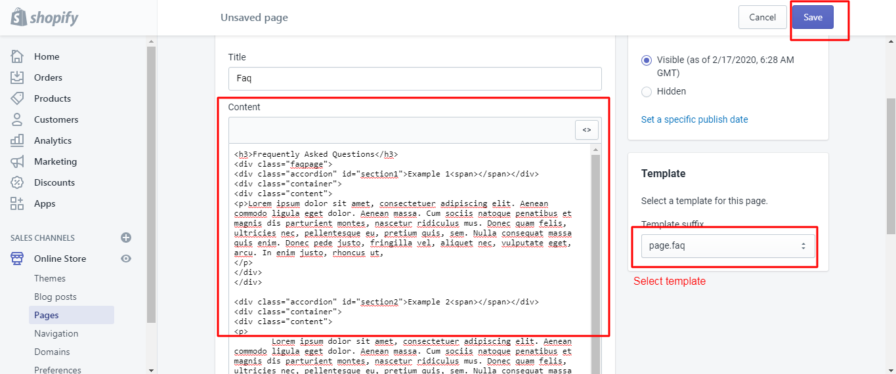

# Create FAQ Page
- step 1. Download Package
- step 2. Upload files Assets & Templates files
- step 3. Create a cms page faq and select template files 



## Add jquery library 

- step 4. theme.liquid

```bash
{{ '//code.jquery.com/jquery-1.11.3.min.js' | script_tag }}
```
